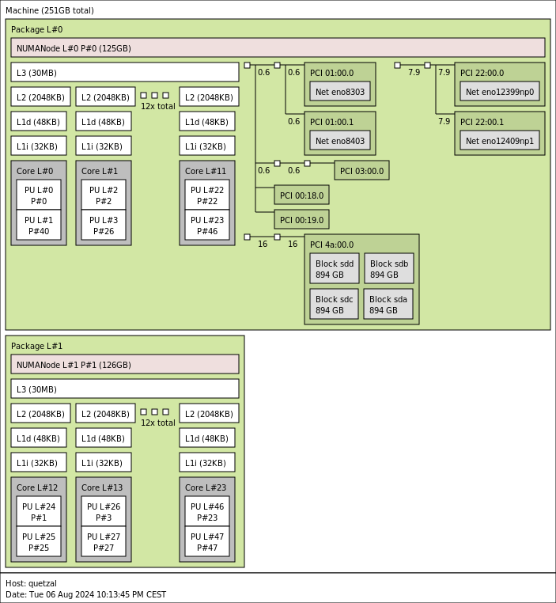
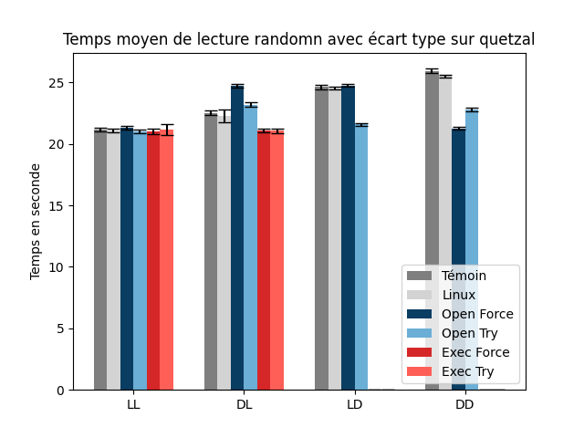
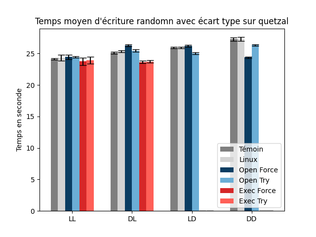
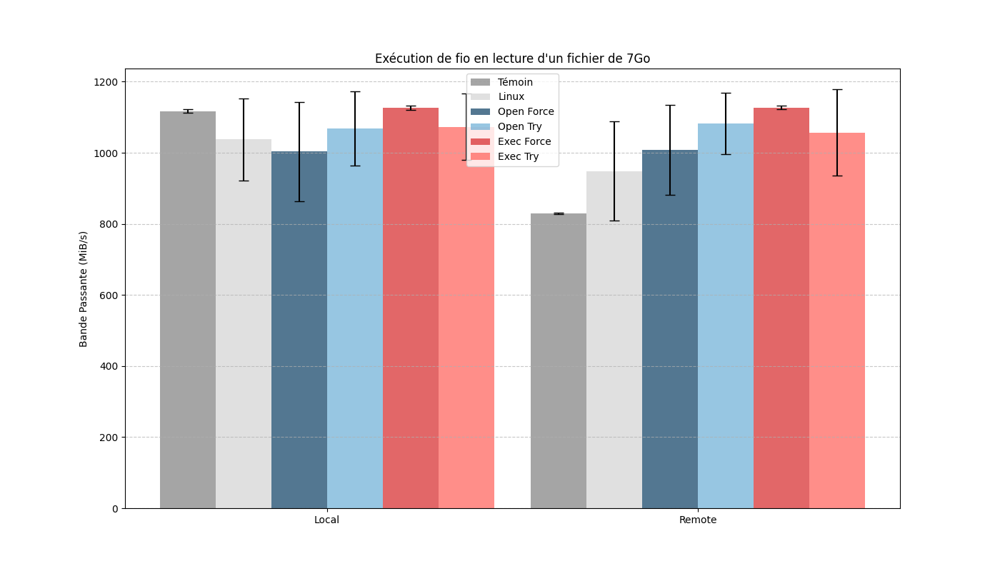
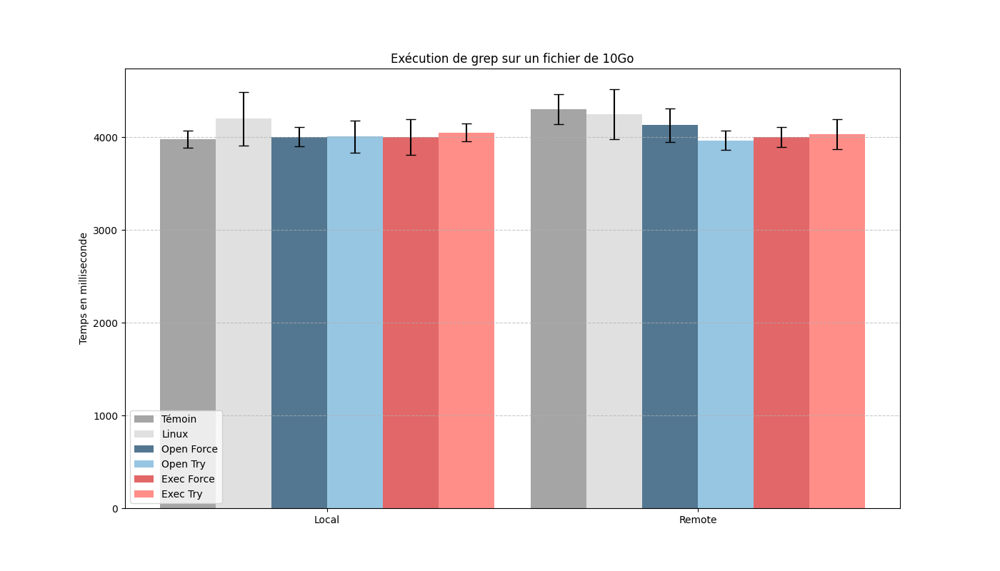

# Optimisation des processus selon les données en mémoire

# Sommaire
 - [Présentation](#Présentation)
 - [Installation](#Installation)
 - [Utilisation](#Utilisation)
 - [Fonctionnalité](#Fonctionnalité)
 - [Perspective](#Perspective)

# Présentation
Le but de ce projet est d'optimiser les entrées/sorties des fichiers sur une architecture NUMA (Non-Uniform Memory Access), en déplaçant un processus vers un cœur situé sur le nœud où les fichiers qu'il utilise sont chargés en mémoire.

## Lien vers le projet
Vous pouvez consulter et télécharger ce projet à partir du dépôt suivant :  [https://github.com/taraaggoun/numabench.git](https://github.com/taraaggoun/numabench.git).

# Installation
Ce projet nécessite l'installation des paquets suivants :
- libnuma-dev
- fio

Il a été développé avec la version [6.6.21](https://cdn.kernel.org/pub/linux/kernel/v6.x/linux-6.6.21.tar.xz) du noyau Linux.

# Utilisation

## Patch
Dans le répertoire `patch`, se trouvent 4 patchs du noyau Linux (ainsi que leurs versions inverses) qui affectent un nœud NUMA à un processus en fonction de l'utilisation de fichiers déjà chargés en mémoire sur ce nœud.

- Deux des patchs appliquent l'optimisation lors de l'ouverture du fichier (préfixe `open`), en vérifiant si le fichier est déjà chargé en mémoire. Les deux autres effectuent l'optimisation à l'exécution (préfixe `exec`), en vérifiant si les paramètres sont chargés en mémoire.
- Deux des patchs forcent le processus à changer de nœud NUMA (suffixe `force`). Les deux autres proposent simplement un nœud a l'ordonnanceur (suffixe `try`). Il décidera ou non de basculer le processus de noeud.

### Compilation et Exécution
L'optimisation au niveau de l'ouverture de fichier est protégée par un ioctl. Voici les étapes pour l'activer :
```bash=
cd ioctl
make
insmod openctl.ko
dmesg
mknod /dev/openctl c [major] 0
```
Le numero major est recupéré par la comande `dmesg`

## Benchmark
Ce projet dispose de 3 benchmarks différents :

1. Numabench : Un benchmark qui mesure le temps de lecture/écriture d’un fichier en fonction de la localité des pages du fichier et du buffer de lecture/écriture. Il propose 4 configurations :
    - LL : Les pages et le buffer sont situés sur le même nœud que le processus.
    - LD : Les pages sont locales au processus, mais le buffer est sur un nœud distant.
    - DL : Les pages sont distantes au processus, mais le buffer est sur le nœud local.
    - DD : Les pages et le buffer sont situés sur un nœud distant par rapport au processus.

2. Fio : Ce programme charge un fichier en mémoire, puis exécute la commande `fio` soit sur un nœud local, soit sur un nœud distant par rapport aux pages chargées dans le page cache.

3. Grep : Ce programme charge un fichier en mémoire, puis exécute la commande `grep` depuis un nœud local ou distant par rapport aux pages présentes dans le page cache.

### Compilation et Exécution
```bash=
cd [nom du test]
make
```
#### Numabench :
-   Pour toutes les configuration sauf exec 
    ```bash=
    ./numabench.sh [num_config]
    ```

- Pour les configuration exec
    ```bash=
    cd exec
    make
    ./run_exec [num_config]
    ```

#### Fio :
```bash=
./run_fio [num_config]
```
#### Grep :
```bash=
./run_grep [num_config]
```

Il est possible de compiler tout les répertoire depuis la racine avec la commande `make` ou un seul sous-répertoire avec `make [nom du sous répertoire]`.
Les fichiers contenant les résultat sont sauvegarder dans le répertoire `[nom du test]/media`
Pour généré les graph il suffit d'exécuté la commande `python3 graph.py`

# Fonctionnalité
## configuration
Les benchmarks sont exécutés sur 6 configurations différentes :
- Témoin (0) : Le processus est lancé sur un nœud et est forcé de rester dessus.
- Linux (1) : Le processus est lancé sur un nœud et pourra en changer durant son exécution.
- Open_force (2) : Le processus est lancé sur un nœud. À chaque ouverture de fichier, si le fichier est chargé en mémoire, le processus sera forcé de s'exécuter sur le nœud où il est chargé.
- Open_try (3) : Le processus est lancé sur un nœud. À chaque ouverture de fichier, si le fichier est chargé en mémoire, il sera proposé a l'ordonnanceur de s'exécuter sur le nœud où il est chargé.
- Exec_force (4) : Le processus est lancé sur un nœud. À l'exécution, le processus sera forcé de s'exécuter sur le nœud où le plus de paramètres sont chargés en mémoire.
- Exec_try (5) : Le processus est lancé sur un nœud. À l'exécution, il sera proposé a l'ordonnanceur que le processus s'exécute sur le nœud où le plus de paramètres sont chargés en mémoire.

## Résultats
### Configuration de la machine de test
Les expérimentations ont été réalisées sur une machine comportant 2 noeuds NUMA, avec les caractéristiques suivantes :
- Processeur : 2 x Intel Xeon Silver 4410Y @ 3.90GHz (24 cœurs / 48 threads)
- Mémoire : 251 Go de RAM (125 + 126 Go)
- Système d'exploitation : Debian 12 avec noyau 6.6.21 (x86_64)

Voici le résultat de la commande `lstopo` :


### Numabench
|  |  |
|------------------------|------------------------|

Sur ces graphes, on peut observer le temps de lecture (à gauche) et d’écriture (à droite) aléatoire dans un fichier de 3 Gio, en fonction du placement des pages et du buffer par rapport au thread pour chaque configuration.

- Le **Témoin** représente le temps minimum en **LL** et maximum en **LD**.
- La configuration **Linux** reste proche du **Témoin**, bien que parfois, un écart-type plus important soit visible. Cet écart provient du fait que le thread peut être déplacé d’un cœur à un autre par l’ordonnanceur pendant son exécution.

- Pour les patchs **open**, selon la configuration :
    - **LL** : On observe des performances proches de celles du **Témoin**.
    - **DL** : Comme le thread a été déplacé sur le même nœud que les pages, on se retrouve dans une configuration **LD**, où les pages sont locales et le buffer est distant. Cela explique pourquoi la configuration **Open Force** atteint des performances équivalentes au **Témoin LD**. La configuration **Open Try** se situe entre le **Témoin DL** et **LD**, car le thread est proposé a l'ordonnanceur pour être déplacé, mais cela ne se fait pas systématiquement en raison de conflits avec la mémoire anonyme.
    - **LD** : Pour **Open Force**, le thread est forcé de rester local sur le nœud où les pages sont situées, mais distant de la mémoire anonyme. Pour **Open Try**, l'ordonnanceur peut choisir de déplacer le thread pour qu’il soit local à la mémoire anonyme, ce qui explique la différence de performance entre les deux.
    - **DD** : On revient à une configuration **LL**.

- Il n'y a pas de valeurs pour les configurations **exec** dans les catégories **LD** et **DD**, car le processus est déplacé de cœur à l'exécution, et par défaut, l'allocation de mémoire anonyme se fait localement. Quand les pages sont en local, on observe des performances proches du **Témoin**, et lorsqu’elles sont distantes, un écart avec le **Témoin** apparaît, car le temps est équivalent au temps en local.

### Fio


Sur ce graphe, on peut observer la bande passante calculée par l'exécution de la commande `fio` sur un fichier de 7 Gio pour chaque configuration, lancée en local ou en distant par rapport à la localisation des pages du fichier sur les nœuds.

On peut constater que seule la configuration **Exec Force** parvient à égaler le **Témoin** en local et en distant. Bien qu'une amélioration en distant soit visible pour toutes les configurations, **Exec Force** reste la plus performante.

### Grep


# Perspective
Voici plusieurs perspectives pour améliorer notre approche :

- Dans notre réalisation, à chaque ouverture de fichier, nous recherchons le nombre de pages chargées en mémoire sur chaque nœud pour le fichier. Une amélioration possible serait d'utiliser un compteur mis à jour chaque fois qu'une page est ajoutée ou retirée du page cache.
- Dans l'optimisation au niveau de l'exécution, à chaque exécution d'un exécutable, nous vérifions tous les paramètres pour déterminer s'ils sont des fichiers. Une amélioration possible serait d'annoter l'exécutable afin qu'il enregistre s'il utilise des fichiers en paramètres.
- Enfin, nous avons deux types de patchs. Le premier force un processus à rester sur un nœud, ce qui peut poser problème si plusieurs processus utilisent le même fichier, car cela pourrait saturer le nœud, tandis que d'autres resteraient sous-utilisés. Le deuxième type de patch propose à l'ordonnanceur de déplacer le processus sur un nœud spécifique, mais celui-ci n'est pas obligé de le respecter. Une amélioration possible serait d'attribuer un poids à chaque nœud NUMA de la machine. Le processus aurait ainsi plus de chances de s'exécuter sur le nœud avec le poids le plus élevé, mais si ce nœud est déjà surchargé, il s'exécuterait sur un nœud avec un poids plus faible. Ce poids serait calculé en fonction du nombre de pages du fichier chargées en mémoire sur chaque nœud.